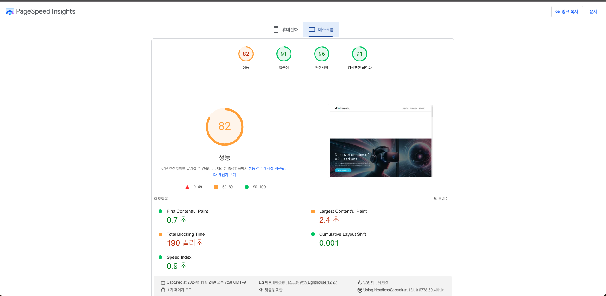

# 바닐라 JS 프로젝트 성능 개선
- [배포 url](https://front-3rd-chapter4-2-basic-eta.vercel.app/)

## 성능 개선 보고서 

### 개선 전

#### 개선 전 성능 측정

|Metrics|측정값|
|------|---|
|FCP|2.4 s|
|LCP|11.0 s|
|TBT|610 ms|
|CLS|0.011|
|Speed Index|2.4 s|

#### 개선 이유와 개선해야하는 항목

웹사이트의 성능을 개선하여 사용자 경험을 향상시키고, 검색 엔진 최적화(SEO)를 개선하며, 전환율을 높이기 위해 성능 개선을 진행했습니다.

- LCP (Largest Contentful Paint)
   - 이유 
      -  LCP가 11초로 높은 편이며, 사용자가 주요 콘텐츠를 보는 데 오랜 시간이 걸리며 사용자 경험을 위해 개선되어야 합니다. 
   - 개선 항목   
     - 서버 응답 시간 단축
     - 불필요한 렌더 제거
     - 이미지 최적화 
     - 중요 리소스 미리 로드

- TBT (Total Blocking Time) 
   - 이유
      - 페이지 로딩, 페이지가 사용자와 상호작용하는데 발생하는 지연 시간을 말하는데 610ms로 높은 편입니다.
   - 개선 항목 
      - JavaScript 실행 지연 (async 속성 사용)
      - 긴 작업 분할

- FCP (First Contentful Paint) 
   - 이유
      - 페이지의 콘텐츠가 렌더링 되는 시간을 측정하는데 사용자가 페이지에 로딩되는 시간을 인지하는 지표이며 개선이 필요합니다.   
   - 개선 항목 
      - 서버 응답 시간 개선

- Speed Index 개선
   - LCP 개선 시 개선 될 것으로 보임

#### 개선 방법

- 이미지 최적화
   - loading="lazy" 속성 추가
   - 이미지 width, height 속성 추가
   - 각 높이가 다른 경우 css에 aspect-ratio 속성 추가 
- JavaScript 최적화
   - 스크립트 로딩 지연 (import 시 defer 속성 추가)
   - js 파일 async로 비동기 처리
- 리소스 로딩 최적화
   - 폰트 로딩 최적화 (preload)
- 불필요한 리소스 제거
   - 주석 처리된 CSS 파일 링크 제거

#### 개선 후 향상된 지표

- 개선 후 성능 측정

|Metrics|측정값|
|------|---|
|FCP|0.7 s|
|LCP|2.4 s|
|TBT|190 ms|
|CLS|0.001|
|Speed Index|0.9 s|

  - First Contentful Paint (FCP): 2.4s에서 0.7s로 약 70% 감소
  - Largest Contentful Paint (LCP): 11.0s에서 2.4s로 약 78% 감소
  - Total Blocking Time (TBT): 610ms에서 190ms로 약 69% 감소
  - Cumulative Layout Shift (CLS): 0.011에서 0.001로 약 90% 감소
  - Speed Index: 2.4s에서 0.9s로 약 62% 감소
  
